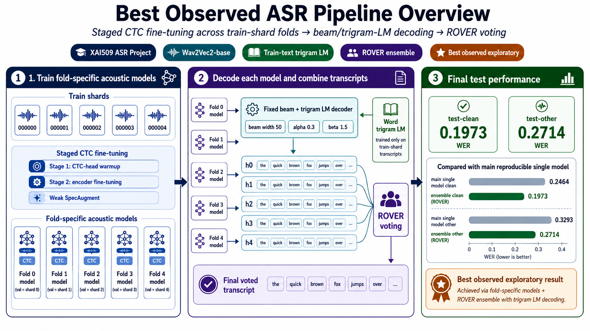

# XAI509 Automatic Speech Recognition Semester Project

**Wav2Vec2-CTC Fine-tuning on the Provided LibriSpeech WebDataset**

## Overview

This project fine-tunes `facebook/wav2vec2-base` with a CTC objective on the
provided LibriSpeech WebDataset and evaluates word error rate (WER) on
`test-clean` and `test-other`. The repository contains the complete training,
decoding, language-model fusion, and evaluation pipeline developed for the
XAI509 Automatic Speech Recognition semester project.

## Pipeline overview

The figure below summarizes the best observed ASR pipeline in this project:
staged CTC fine-tuning across train-shard folds, fixed beam/trigram-LM decoding,
and ROVER word-level voting.

<p align="center">
  
</p>

<p align="center">
  <em>Overview of the best observed exploratory pipeline. The clean main reproducible result is reported separately in the Results section.</em>
</p>

## Method

The main approach is **Staged CTC Fine-tuning**. Since the CTC classification layer is newly initialized for the project tokenizer, training is split into two stages. First, only the CTC head is trained while the Wav2Vec2 backbone is frozen. Then, the Transformer encoder is fine-tuned while the low-level convolutional feature extractor remains frozen. This schedule stabilizes early CTC optimization and reduces blank-dominant predictions.:

1. The CTC head is warmed up while the Wav2Vec2 encoder is frozen.
2. The encoder is fine-tuned while the convolutional feature extractor remains
   frozen.

This schedule stabilizes early CTC optimization and reduces blank-dominant
predictions. Weak SpecAugment is retained during training. At inference time,
the selected acoustic model is decoded with beam search and a word trigram
language model trained only from the provided training transcripts. Model
provenance is recorded for reproducibility.

## Repository structure

```text
README.md                    Project overview and reproduction guide
requirements.txt             Python dependencies
src/                         Training, inference, WER, data, LM, and utilities
scripts/                     Reproducible shell entrypoints
data/README.md               Expected local WebDataset layout
results/                     Compact final CSV and JSON artifacts
reports/                     Main and exploratory result reports
docs/EXPERIMENT_SUMMARY.md   Full experimental process and interpretation
```

Generated checkpoints, predictions, decoder sweeps, logs, and dataset archives
are intentionally excluded from Git.

## Installation

Python 3.10 and a CUDA-capable PyTorch environment are recommended.

```bash
python -m pip install -r requirements.txt
```

Set `PYTHON` to select another Python executable, `GPU_ID` to choose a GPU, and
`LOCAL_FILES_ONLY=1` to require locally cached Hugging Face files.

## Data layout

Place the provided WebDataset archives at:

```text
data/
  train/
    shard-000000.tar
    shard-000001.tar
    shard-000002.tar
    shard-000003.tar
    shard-000004.tar
  test-clean/
    *.tar
  test-other/
    *.tar
```

The main split protocol trains on shards `000000`–`000003` and reserves shard
`000004` for checkpoint selection and decoder tuning. `test-clean` and
`test-other` are used only for final evaluation. See
[data/README.md](data/README.md) for details.

## How to run

Run the main pipeline in order:

```bash
GPU_ID=0 bash scripts/run_train.sh
GPU_ID=0 bash scripts/run_validation_decode.sh
GPU_ID=0 bash scripts/run_test_eval.sh
```

Run the optional all-train experiment with:

```bash
GPU_ID=0 bash scripts/run_exploratory.sh
```

Each entrypoint supports a non-executing inspection mode that validates module
paths and prints the commands it would run:

```bash
DRY_RUN=1 bash scripts/run_train.sh
DRY_RUN=1 bash scripts/run_validation_decode.sh
DRY_RUN=1 bash scripts/run_test_eval.sh
DRY_RUN=1 bash scripts/run_exploratory.sh
```

## Results

| Setting | Role | Validation WER | test-clean WER | test-other WER |
| --- | --- | ---: | ---: | ---: |
| Staged CTC fine-tuned Wav2Vec2 + beam/trigram LM | Main reproducible result | 0.228487 | 0.246386 | 0.329289 |
| Staged CTC All-Train Model | Exploratory all-train | — | 0.216867 | 0.303307 |
| Staged CTC Fold Ensemble with ROVER Voting | Best observed exploratory | — | 0.197314 | 0.271383 |

The selected main decoder uses beam width 50 with the train-text trigram LM,
alpha 0.3, and beta 1.5.

The ROVER system gives the best observed test WER, but it is reported as
exploratory because its validation selection is affected by fold-membership
leakage.

## Detailed experiment summary

The complete experimental narrative—including CTC blank-collapse diagnosis,
SpecAugment stabilization, acoustic model comparison, decoder tuning, final
results, and limitations—is in
[docs/EXPERIMENT_SUMMARY.md](docs/EXPERIMENT_SUMMARY.md).
